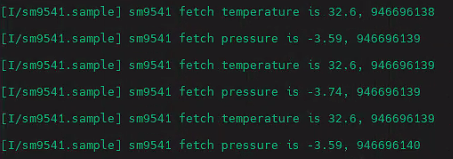

# SM9541数字压力传感器

## 软件包简介

SM9541软件包是基于RT-Thread sensor 框架实现的一个驱动包。

基于该软件包，用户应用程序可使用标准的sensor接口访问sm9541,  获取传感器数据。


## 传感器介绍

SM9541系列

| 功能 | 量程              | 精度  |
| ---- | ----------------- | ----- |
| 气压 | -49.0 — +980.7 Pa | 0.001 |
| 温度 | -5 — +65 ℃        | 0.1   |


## 4支持情况

| 包含设备     | 气压计 | 温度计 |
| ------------ | ------ | ------ |
| 通信接口     |        |        |
| IIC          | √      | √      |
| SPI          |        |        |
| **工作模式** |        |        |
| 轮询         | √      | √      |
| 中断         |        |        |
| FIFO         |        |        |


## 使用说明

### 依赖

- RT-Thread 4.0.0+

- sensor 框架组件

- I2C驱动，sm9541/sm3041 设备使用I2C进行数据通讯，需要I2C驱动框架支持

### 读取压力/温度数据

该软件包基于sensor框架，而sensor框架继承于RT-Thread标准设备框架，

故可以使用RT-Thread标准设备接口" find/open/read "读取传感器数据。

参考伪代码：

```c
struct rt_sensor_data sm95_data[2];
/* 查找设备 */
sm95_dev = rt_device_find("baro_sm9541"); 
/* 打开设备 */
rt_device_open(sm95_dev, RT_DEVICE_FLAG_RDWR);
/* 读取所需数据 */
rt_device_read(sm95_dev, 0, &sm95_data, 2);
rt_device_read(sm95_dev, 0, &sm95_data, 1);
```

### 运行结果

输出格式： 数据 ,  时间戳





## 注意事项

- 如果制度去压力数据，那么定义一个 ```rt_sensor_data``` 变量读取数据即可:

```c
struct rt_sensor_data sm95_data;
/* 查找设备 */
sm95_dev = rt_device_find("baro_sm9541"); 
/* 打开设备 */
rt_device_open(sm95_dev, RT_DEVICE_FLAG_RDWR);
/* 读取所需数据 */
rt_device_read(sm95_dev, 0, &sm95_data, 1);
```

- 如需读取内部温度数据：

```c
struct rt_sensor_data sm95_data[2];
/* 查找设备 */
sm95_dev = rt_device_find("baro_sm9541"); 
/* 打开设备 */
rt_device_open(sm95_dev, RT_DEVICE_FLAG_RDWR);
/* 读取所需数据 */
rt_device_read(sm95_dev, 0, &sm95_data, 2);
```


## 联系人信息

- 维护者：[lizhen9880](https://github.com/lizhen9880)